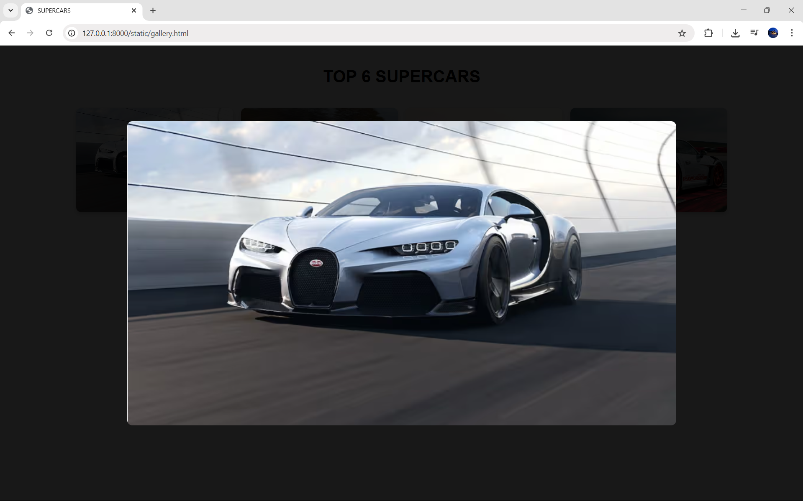
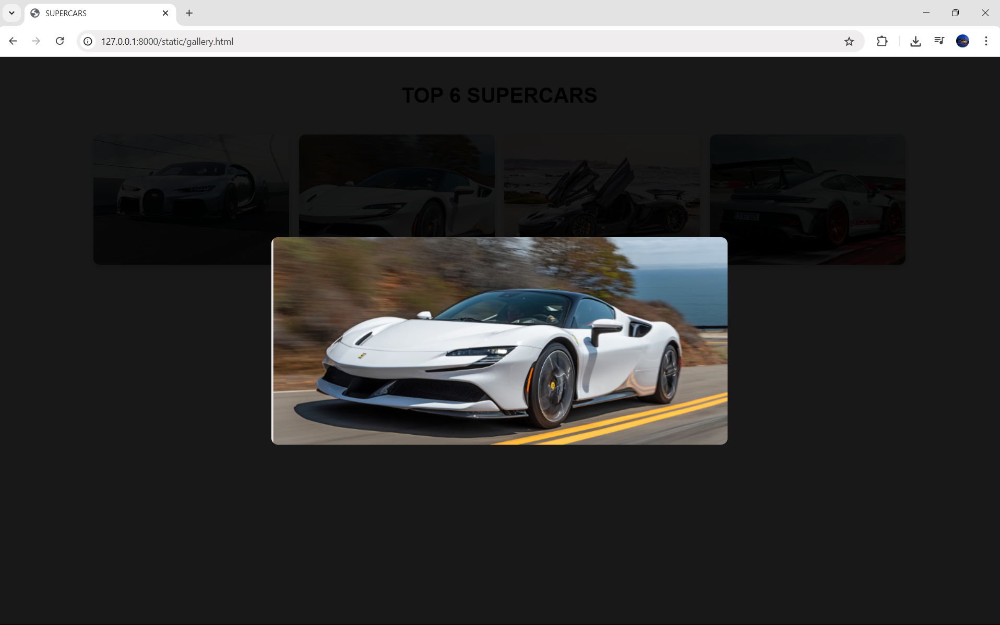
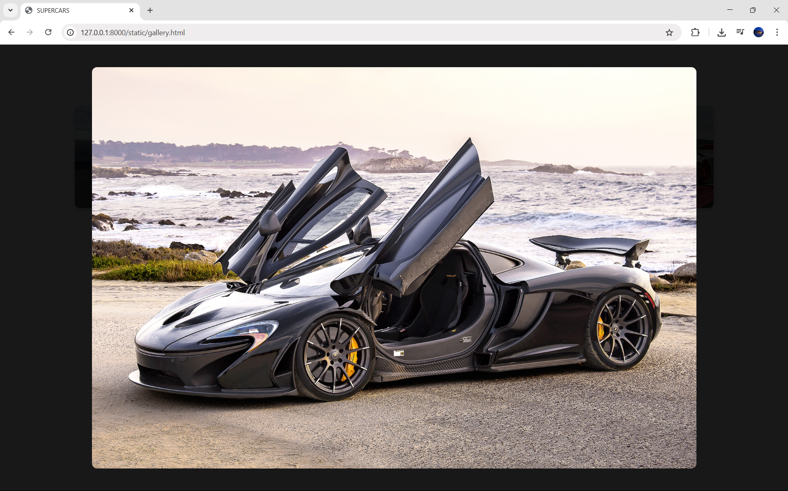
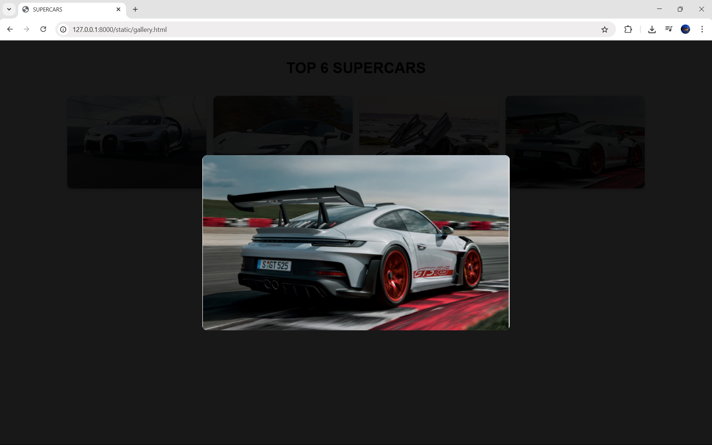
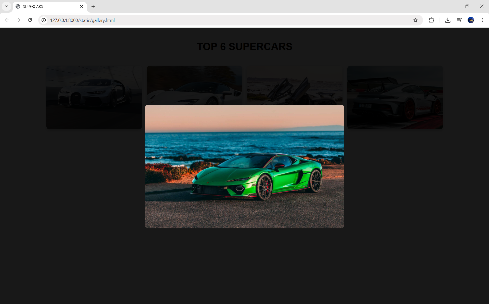
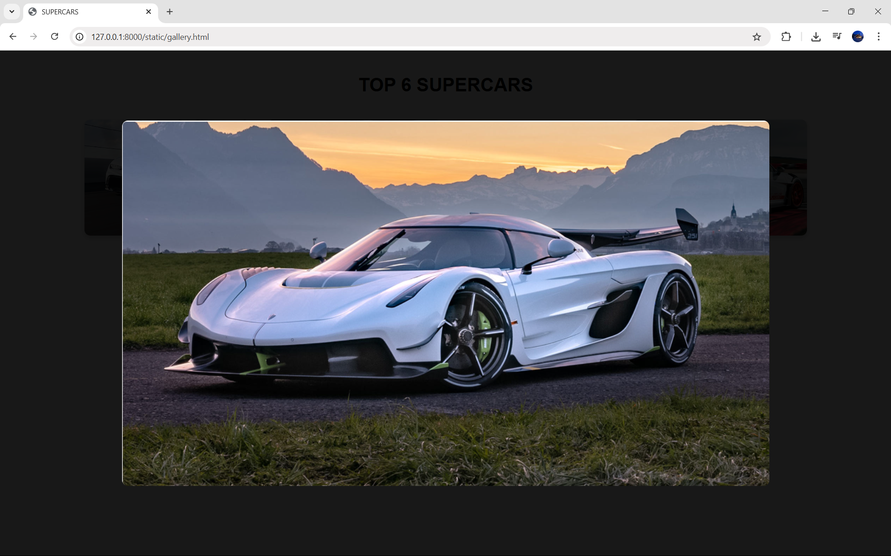

# Ex.08 Design of Interactive Image Gallery
## Date:25.05.2025

## AIM:
To design a web application for an inteactive image gallery with minimum five images.

## DESIGN STEPS:

### Step 1:
Clone the github repository and create Django admin interface.

### Step 2:
Change settings.py file to allow request from all hosts.

### Step 3:
Use CSS for positioning and styling.

### Step 4:
Write JavaScript program for implementing interactivity.

### Step 5:
Validate the HTML and CSS code.

### Step 6:
Publish the website in the given URL.

## PROGRAM :
```
gallery.html

<!DOCTYPE html>
<html lang="en">
<head>
  <meta charset="UTF-8">
  <title>SUPERCARS</title>
  <style>
    body {
      margin: 0;
      font-family: Arial, sans-serif;
      background-color: #f4f4f4;
    }

    .gallery {
      display: flex;
      flex-wrap: wrap;
      justify-content: center;
      gap: 15px;
      padding: 20px;
    }

    .gallery img {
      width: 300px;
      height: 200px;
      object-fit: cover;
      border-radius: 10px;
      cursor: pointer;
      transition: transform 0.3s ease;
      box-shadow: 0 4px 8px rgba(0,0,0,0.2);
    }

    .gallery img:hover {
      transform: scale(1.05);
    }

    /* Lightbox Overlay */
    .lightbox {
      display: none;
      position: fixed;
      top: 0; left: 0;
      width: 100%; height: 100%;
      background-color: rgba(0, 0, 0, 0.9);
      justify-content: center;
      align-items: center;
      z-index: 1000;
    }

    .lightbox img {
      max-width: 90%;
      max-height: 90%;
      border-radius: 10px;
    }

    .lightbox:active {
      display: none;
    }
  </style>
</head>
<body>

  <h1 style="text-align:center; padding-top:20px;">TOP 6 SUPERCARS</h1>

  <div class="gallery">
    
    
    
    
    
    
  </div>

  <!-- Lightbox Container -->
  <div class="lightbox" id="lightbox">
    
  </div>

  <script>
    const lightbox = document.getElementById('lightbox');
    const lightboxImg = document.getElementById('lightbox-img');

    document.querySelectorAll('.gallery img').forEach(image => {
      image.addEventListener('click', () => {
        lightbox.style.display = 'flex';
        lightboxImg.src = image.src;
      });
    });

    // Close lightbox on click anywhere
    lightbox.addEventListener('click', () => {
      lightbox.style.display = 'none';
    });
  </script>

</body>
</html>

```
## OUTPUT:








## RESULT:
The program for designing an interactive image gallery using HTML, CSS and JavaScript is executed successfully.
